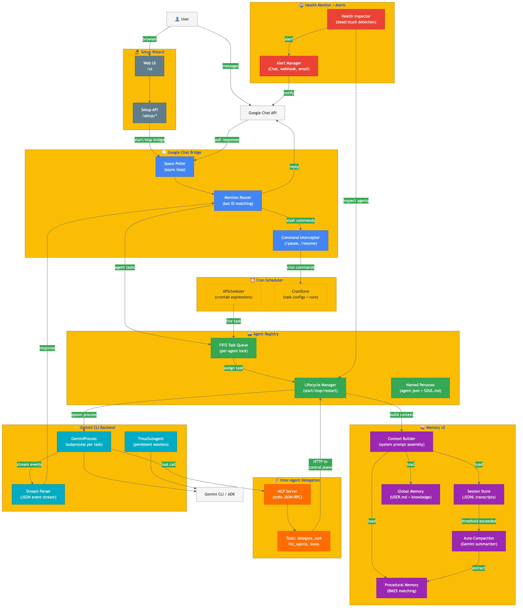

# g3lobster

Google Chat-first multi-agent service with named personas, layered memory, and FastAPI control APIs.

## Highlights

- Named agents with persistent identity (`agent.json`, `SOUL.md`, `.memory/*`, `sessions/*.jsonl`)
- Memory v2: auto-compaction of long sessions + procedural memory extraction
- Global user memory at `data/.memory` (shared preferences, procedures, and knowledge files)
- One Google Chat bot per agent (`bot_user_id` link + mention routing)
- Guided setup wizard at `/ui` for OAuth credentials, space setup, first agent, and launch
- Agent lifecycle APIs (`start`, `stop`, `restart`, memory/session inspection)

## Architecture



All 8 subsystems and their data flows:

| Colour | Subsystem | Key files |
|--------|-----------|-----------|
| 🔵 Blue | Google Chat Bridge — polling + mention routing | `g3lobster/chat/bridge.py` |
| 🟢 Green | Agent Registry — named personas, lifecycle, FIFO queue | `g3lobster/agents/registry.py` |
| 🟣 Purple | Memory v2 — sessions, compaction, procedures, global memory | `g3lobster/memory/` |
| 🟠 Orange | Inter-Agent Delegation — MCP stdio server | `g3lobster/mcp/delegation_server.py` |
| 🔷 Cyan | Gemini CLI Backend — subprocess per task, stream parser | `g3lobster/cli/process.py` |
| 🟡 Yellow | Cron Scheduler — APScheduler + CronStore | `g3lobster/cron/manager.py` |
| 🔴 Red | Health Monitor + Alerts — dead/stuck detection, multi-sink alerts | `g3lobster/alerts.py`, `g3lobster/pool/health.py` |
| ⚫ Grey | Setup Wizard — web UI + REST API | `g3lobster/api/routes_setup.py`, `g3lobster/static/` |

<details>
<summary>SVG version (scalable)</summary>


</details>

<details>
<summary>Mermaid source</summary>

The diagram source lives at [`docs/architecture.mmd`](docs/architecture.mmd). Regenerate with:

```bash
npx @mermaid-js/mermaid-cli -i docs/architecture.mmd -o docs/architecture.png -s 3 -b white
npx @mermaid-js/mermaid-cli -i docs/architecture.mmd -o docs/architecture.svg -b transparent
```
</details>

## Layout

- `g3lobster/agents/persona.py`: persona data model + filesystem CRUD
- `g3lobster/agents/registry.py`: named-agent runtime registry
- `g3lobster/chat/bridge.py`: Google Chat polling and mention-to-agent routing
- `g3lobster/api/routes_agents.py`: agent/global memory CRUD + lifecycle/session routes
- `g3lobster/api/routes_setup.py`: setup and bridge control routes
- `g3lobster/memory/compactor.py`: message-count based auto-compaction
- `g3lobster/memory/procedures.py`: procedural memory extraction and matching
- `g3lobster/memory/global_memory.py`: global `.memory` manager
- `g3lobster/static/`: setup wizard + agent management UI

## Prerequisites

- Python 3.9+
- [uv](https://docs.astral.sh/uv/) (do **not** use pip)
- [Gemini CLI](https://github.com/google-gemini/gemini-cli) installed and on `PATH`

## Run

```bash
cd apps/g3lobster
uv pip install -e ".[dev]"
make run
```

Or with explicit options:

```bash
python3 -m g3lobster --config config.yaml --host 0.0.0.0 --port 40000
```

Open `http://localhost:40000/ui` and complete the wizard.

## Environment Overrides

Any config value can be set via env var: `G3LOBSTER_{SECTION}_{KEY}` (uppercase).

```bash
G3LOBSTER_SERVER_PORT=8080      # change port
G3LOBSTER_CHAT_ENABLED=true     # enable Google Chat bridge
G3LOBSTER_GEMINI_COMMAND=gemini # path to Gemini CLI
```

## Agent Data Layout

```text
data/agents/{agent_id}/
  agent.json
  SOUL.md
  .memory/MEMORY.md
  .memory/PROCEDURES.md
  .memory/daily/*.md
  sessions/*.jsonl

data/.memory/
  USER.md
  PROCEDURES.md
  knowledge/*
```

## API Quick Checks

```bash
curl -s localhost:40000/health
curl -s localhost:40000/setup/status
curl -s localhost:40000/agents
```

## Testing

```bash
cd apps/g3lobster
uv pip install -e ".[dev]"
make fmt && make lint && make test
```
